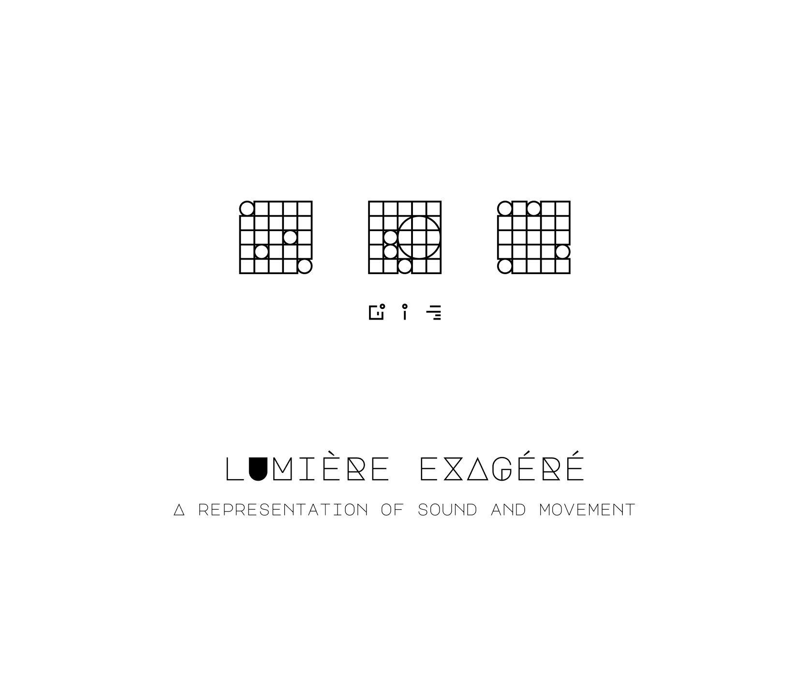
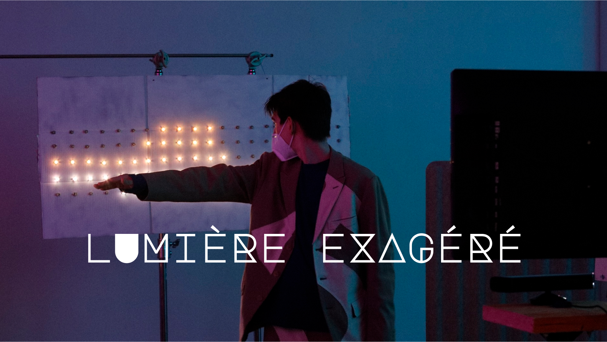
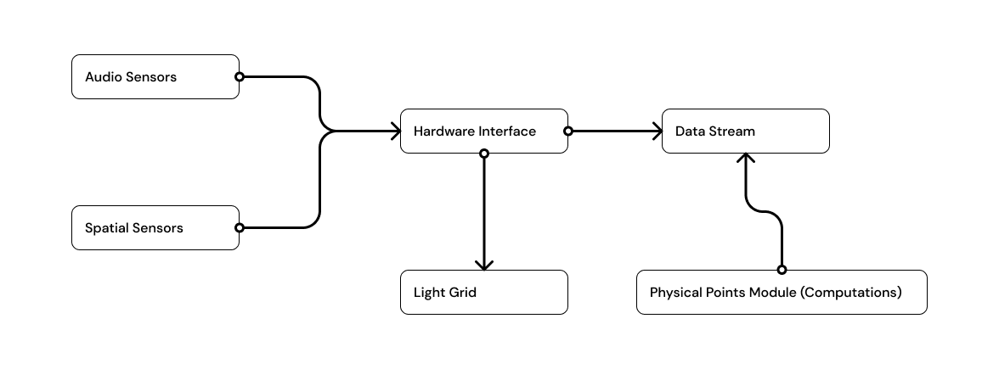

  

 

# lumière exagéré

## What is it?
lumière exagéré is a visual representation of sound and movement. Additionally, it is being accounted for my honours project in the Bachelor's Degree of Computer Science at Carleton University.

[Video demonstration of its display at KOSMIC 2022](https://www.youtube.com/watch?v=yNsTve8e0Zg)

## How does it work?

This project is mainly split into four different sections which are
 
1. Receiving movement through a Kinect camera
2. Processing of spatial coordinates in NodeJS
3. Emiting signals through an Arduino Uno board
4. Creating music by reflecting an interaction as a set of instructions for how to play a bar in 160 bpm of 4/4

## Motion & depth capture
- [OpenFrameworks](https://openframeworks.cc/)
- [ofxKinect](https://github.com/ofTheo/ofxKinect)
- [Poco](https://pocoproject.org/)

## Sound 
- [play-sound](https://github.com/shime/play-sound)

## Motion calculations
- [Node](https://nodejs.org/en/)
- [rbush-3d](https://github.com/Eronana/rbush-3d)

## Hardware

### Camera
- Kinect (Model 1414)

### Computing
- Arduino Uno board
- [johnny-five](https://github.com/rwaldron/johnny-five)
- [node-pixel](https://github.com/ajfisher/node-pixel)

**Important**
To use node-pixel on an M1 machine, I had to install `firmata` separately and then force the installation of `node-pixel`

### LEDs
- 4x 50 Rextin® WS2811 Pixels Digital Addressable LED String Lights (5V)

## Inspiration

This idea began with a visit to the Immersive Van Gogh experience in Toronto and the thought of creating a creative space in real life outside of pixels in a computer which is what most of my undergrad degree has been about. The works of [Breakfast Studio New York](https://breakfastny.com/) and [Karyn Nakamura](https://karynnakamura.com/) were also a great source of inspiration.

## Thank you
A thank you to all my friends who helped me out getting through this project by believing in me and what I wanted to accomplish. Special thanks to the friends of mine who at times were a second brain to bounce ideas with and helped me finding tools I could not know where to even start digging.
