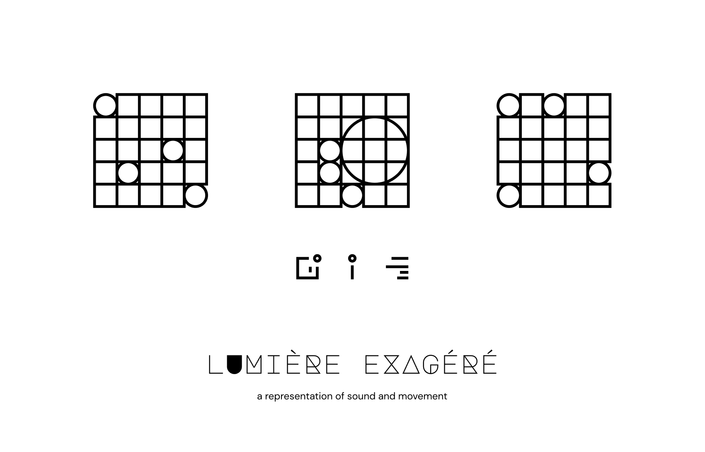
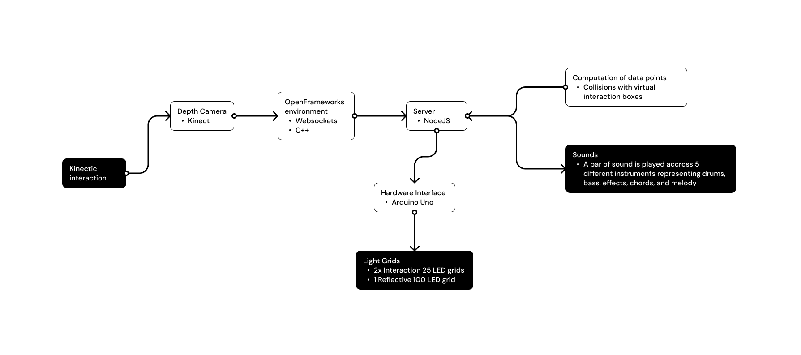

  

 

# Project Lumens (lumière exagéré)

## What is it?
Project Lumens is a visual representation of sound and movement. Additionally, it is being accounted for my honours project for the Bachelor's Degree of Computer Science at Carleton University.

---

## How does it work?

---

## Dependencies

---

### Movement
- [OpenFrameworks](https://openframeworks.cc/)
- [ofxKinect](https://github.com/ofTheo/ofxKinect)
- [Poco](https://pocoproject.org/)

### Sound TBD

### Triangulation
- [Node](https://nodejs.org/en/)

---

## Hardware
- Kinect (Model 1414)
